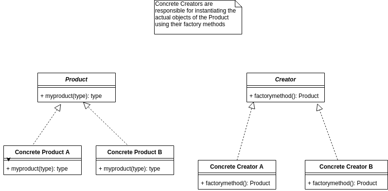
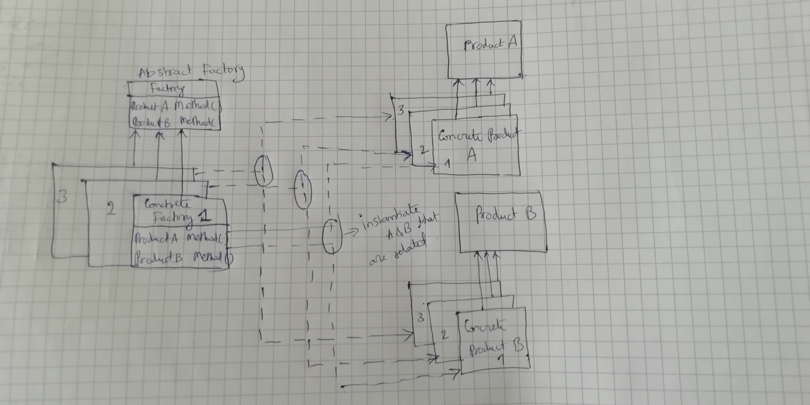
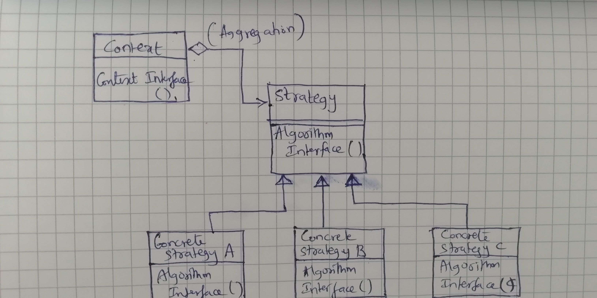

Below design patterns are discussed:  
Builder, Factory Method, Abstract Factory, Strategy, Observer,
Singleton, State, Adapter, Chain of Responsibilty

### Builder

**Definition**:  
Is used to separate the construction of a complex object from its representation.
**Problem**:  
We want to construct a complex object, however we do not want to have a complex constructor member or one that would need many arguments.  
**Solution**:  
Delay the construction of the complex object by building it part by part considering all the arguments for building it.  

_Director_-> Directs the builder to build the complex object part by part and return the complex object  
_Builder_-> Abstract class which must be inherited by classes which help build the sub parts of the complex object  
_Product_-> Product is built using _Builder_ and _Director_

E.g :  
Building Plane(product) from its various parts. See builder.cpp for details

### Factory Method

**Definition**:  
Factory Method lets a class defer instantiation to subclasses.  
**Problem**:  
We want to decide at run time what object is to be created based on some configuration or params.When we write the code, we do not know what class should be instantiated.  
**Solution**:  
Define an interface for creating an object, but let subclasses decide which class to instantiate.

When Factory Method does not use any interface abstract class (i.e use subclasses to instantiate object) or in other words there is only one concrete class to instantiate the object then it becomes Simple Factory or Factory

_Note_: Here we instantiate only a single product object

_UML_:  

E.g. : 

Building a product uses Creator which at run time decides through the Concrete Creator as to which of the product class to be instantiated.   

### Abstract Factory Method

Almost similar to factory method, however the change here is that an abstract factory method can instantiate multiple objects of the products which can be grouped together using multiple interface functions  
E.g. :  
If we have product's A and B (say A = theme backgroud and B = Button of UI). They are related products and they can be combined to generate a UI for Win, Linux or MacOS.

Win =   A(square button)    + B (black theme)  
Linux = A (circular button) + B (white theme)  
MacOS = A(rectangle button) + B (Yellow theme)

_Note_: Here we instantiate multiple product objects that can be grouped together

_UML_:  
  

**Behavioral design patterns** are design patterns that identify common communication patterns among objects.  
e.g. Strategy, Observer, State etc

**NOTE**:  
Aggregation is done using pointer to the object of the class
Composition is done using the object of the class

### Strategy

This resembles the OCP(Open Closed Principle).  
_Definition_: Algorithms can be selected on the fly, using composition.  

It's a bad idea to use inheritence to solve problems as it may happen that when a method is not needed, it still needs to be implemented in the derived classes 

E.g. :  

Sorting algorithm/Strategy can be selected at run time. This is implemented using aggregation.See strategy.cpp for more details.  
_UML_:  

